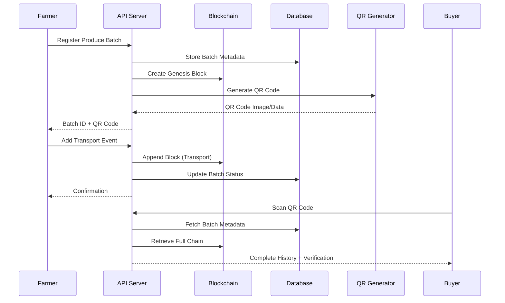

# Design Document: Blockchain Produce Traceability System

## Overview

A blockchain-powered farm produce traceability system for Go backend that enables farmers to register produce batches, generate QR codes, and provide transparent access to product history. The system leverages an immutable blockchain ledger to record all transactions (registration, transfers, quality checks) ensuring data integrity and preventing tampering. Buyers can scan QR codes to verify authenticity and view complete supply chain history from farm to market.

## Main Algorithm/Workflow



## Core Interfaces/Types

```go
// Batch represents a registered produce batch
type Batch struct {
	ID            string    `gorm:"primaryKey" json:"id"`
	FarmerID      string    `gorm:"index" json:"farmer_id"`
	ProduceType   string    `json:"produce_type"`   // potatoes, fish, vegetables, maize
	Quantity      float64   `json:"quantity"`       // in kg
	Unit          string    `json:"unit"`           // kg, tons, pieces
	HarvestDate   time.Time `json:"harvest_date"`
	Location      string    `json:"location"`       // GPS coordinates or farm name
	Status        string    `json:"status"`         // registered, in_transit, delivered, sold
	QRCodePath    string    `json:"qr_code_path"`   // path to QR code image
	GenesisHash   string    `json:"genesis_hash"`   // first block hash
	CurrentHash   string    `json:"current_hash"`   // latest block hash
	CreatedAt     time.Time `json:"created_at"`
	UpdatedAt     time.Time `json:"updated_at"`
}

// Block represents a blockchain block for traceability
type Block struct {
	ID          uint      `gorm:"primaryKey" json:"id"`
	BatchID     string    `gorm:"index" json:"batch_id"`
	Index       int       `json:"index"`
	Timestamp   time.Time `json:"timestamp"`
	EventType   string    `json:"event_type"`   // registration, transport, quality_check, transfer, sale
	EventData   string    `json:"event_data"`   // JSON string with event details
	ActorID     string    `json:"actor_id"`     // user who created this event
	ActorRole   string    `json:"actor_role"`   // farmer, transporter, buyer, inspector
	PrevHash    string    `json:"prev_hash"`
	Hash        string    `json:"hash"`
	CreatedAt   time.Time `json:"created_at"`
}

// EventData structures for different event types
type RegistrationEvent struct {
	ProduceType string    `json:"produce_type"`
	Quantity    float64   `json:"quantity"`
	Unit        string    `json:"unit"`
	HarvestDate time.Time `json:"harvest_date"`
	Location    string    `json:"location"`
	FarmName    string    `json:"farm_name"`
}

type TransportEvent struct {
	FromLocation string    `json:"from_location"`
	ToLocation   string    `json:"to_location"`
	TransportID  string    `json:"transport_id"`
	VehicleInfo  string    `json:"vehicle_info"`
	DepartureTime time.Time `json:"departure_time"`
	EstimatedArrival time.Time `json:"estimated_arrival"`
}

type QualityCheckEvent struct {
	InspectorID   string    `json:"inspector_id"`
	InspectorName string    `json:"inspector_name"`
	Grade         string    `json:"grade"`        // A, B, C
	Notes         string    `json:"notes"`
	Temperature   float64   `json:"temperature"`  // for perishables
	Passed        bool      `json:"passed"`
}

type TransferEvent struct {
	FromOwnerID   string    `json:"from_owner_id"`
	ToOwnerID     string    `json:"to_owner_id"`
	TransferType  string    `json:"transfer_type"` // sale, donation, return
	Price         float64   `json:"price"`
	Currency      string    `json:"currency"`
}

// API Request/Response structures
type RegisterBatchRequest struct {
	ProduceType string    `json:"produce_type" binding:"required"`
	Quantity    float64   `json:"quantity" binding:"required,gt=0"`
	Unit        string    `json:"unit" binding:"required"`
	HarvestDate time.Time `json:"harvest_date" binding:"required"`
	Location    string    `json:"location" binding:"required"`
	FarmName    string    `json:"farm_name"`
}

type RegisterBatchResponse struct {
	BatchID    string `json:"batch_id"`
	QRCodeURL  string `json:"qr_code_url"`
	QRCodeData string `json:"qr_code_data"` // base64 encoded image
	GenesisHash string `json:"genesis_hash"`
}

type AddEventRequest struct {
	EventType string                 `json:"event_type" binding:"required"`
	EventData map[string]interface{} `json:"event_data" binding:"required"`
}

type TraceabilityResponse struct {
	Batch      Batch   `json:"batch"`
	Blockchain []Block `json:"blockchain"`
	Verified   bool    `json:"verified"`
	ChainValid bool    `json:"chain_valid"`
}


## Key Functions with Formal Specifications

### Function 1: RegisterBatch()

```go
func RegisterBatch(db *gorm.DB, farmerID string, req RegisterBatchRequest) (*RegisterBatchResponse, error)
```

**Preconditions:**
- `db` is a valid, open database connection
- `farmerID` is non-empty string representing authenticated farmer
- `req.ProduceType` is non-empty and valid produce type
- `req.Quantity` is positive number (> 0)
- `req.Unit` is non-empty string (kg, tons, pieces)
- `req.HarvestDate` is valid date not in future

**Postconditions:**
- Returns `RegisterBatchResponse` with unique `BatchID` on success
- Creates new `Batch` record in database with status "registered"
- Creates genesis block (index 0) in blockchain for this batch
- Generates QR code image and stores path in batch record
- `response.GenesisHash` matches the hash of genesis block
- Returns error if any database operation fails
- No partial state: either all operations succeed or all rollback

**Loop Invariants:** N/A (no loops in main logic)

---

### Function 2: CreateBlock()

```go
func CreateBlock(batchID string, index int, eventType string, eventData string, 
                 actorID string, actorRole string, prevHash string) Block
```

**Preconditions:**
- `batchID` is non-empty string
- `index` is non-negative integer (>= 0)
- `eventType` is valid event type (registration, transport, quality_check, transfer, sale)
- `eventData` is valid JSON string
- `actorID` is non-empty string
- `actorRole` is valid role (farmer, transporter, buyer, inspector)
- `prevHash` is valid hash string (64 hex characters for SHA-256)

**Postconditions:**
- Returns `Block` with all fields populated
- `block.Timestamp` is set to current UTC time
- `block.Hash` is computed from block contents using SHA-256
- `block.Hash` is deterministic: same inputs always produce same hash
- `block.PrevHash` equals input `prevHash`
- Block is immutable once created

**Loop Invariants:** N/A

---

### Function 3: ComputeBlockHash()

```go
func ComputeBlockHash(block Block) string
```

**Preconditions:**
- `block` is a valid Block structure with all required fields

**Postconditions:**
- Returns 64-character hexadecimal string (SHA-256 hash)
- Hash is deterministic: same block data always produces same hash
- Hash computation includes: BatchID, Index, Timestamp, EventType, EventData, ActorID, ActorRole, PrevHash
- No side effects on input block

**Loop Invariants:** N/A

---

### Function 4: ValidateChain()

```go
func ValidateChain(blocks []Block) bool
```

**Preconditions:**
- `blocks` is a slice of Block structures
- `blocks` is ordered by Index (ascending)
- `len(blocks) >= 1` (at least genesis block exists)

**Postconditions:**
- Returns `true` if and only if chain is valid
- Chain is valid when:
  - Genesis block (index 0) has PrevHash = "0"
  - Each block's Hash matches recomputed hash from its data
  - Each block's PrevHash matches previous block's Hash
  - Block indices are sequential (0, 1, 2, ...)
- Returns `false` if any validation check fails
- No mutations to input blocks

**Loop Invariants:**
- For each iteration i (1 to len(blocks)-1):
  - All blocks from 0 to i-1 have been validated
  - blocks[i].PrevHash == blocks[i-1].Hash
  - blocks[i].Hash == ComputeBlockHash(blocks[i])
  - blocks[i].Index == i

---

### Function 5: GenerateQRCode()

```go
func GenerateQRCode(batchID string, outputPath string) (string, error)
```

**Preconditions:**
- `batchID` is non-empty string
- `outputPath` is valid writable directory path
- System has write permissions to `outputPath`

**Postconditions:**
- Returns file path to generated QR code image on success
- QR code encodes URL: `https://domain.com/trace/{batchID}`
- Image is saved as PNG format
- File size is reasonable (< 100KB)
- Returns error if file write fails or QR generation fails
- No partial files left on error

**Loop Invariants:** N/A

---

### Function 6: AddEvent()

```go
func AddEvent(db *gorm.DB, batchID string, actorID string, actorRole string, 
              eventType string, eventData map[string]interface{}) error
```

**Preconditions:**
- `db` is valid, open database connection
- `batchID` exists in database
- `actorID` is non-empty string
- `actorRole` is valid role
- `eventType` is valid event type
- `eventData` is valid map that can be marshaled to JSON

**Postconditions:**
- Creates new block appended to batch's blockchain
- New block's index = previous max index + 1
- New block's PrevHash = previous block's Hash
- Updates batch's CurrentHash to new block's Hash
- Updates batch's Status based on event type
- Returns nil on success, error on failure
- Transaction is atomic: either all updates succeed or all rollback

**Loop Invariants:** N/A

---

### Function 7: GetTraceability()

```go
func GetTraceability(db *gorm.DB, batchID string) (*TraceabilityResponse, error)
```

**Preconditions:**
- `db` is valid, open database connection
- `batchID` is non-empty string

**Postconditions:**
- Returns `TraceabilityResponse` with batch and full blockchain on success
- `response.Blockchain` is ordered by Index (ascending)
- `response.ChainValid` is result of ValidateChain(response.Blockchain)
- `response.Verified` is true if chain is valid and batch.CurrentHash matches last block hash
- Returns error if batch not found
- No mutations to database

**Loop Invariants:** N/A


## Algorithmic Pseudocode

### Main Processing Algorithm: RegisterBatch

```go
ALGORITHM RegisterBatch(db, farmerID, request)
INPUT: db (database connection), farmerID (string), request (RegisterBatchRequest)
OUTPUT: response (RegisterBatchResponse) or error

BEGIN
  ASSERT db != nil
  ASSERT farmerID != ""
  ASSERT request.Quantity > 0
  ASSERT request.HarvestDate <= NOW()
  
  // Step 1: Begin database transaction
  tx := db.Begin()
  
  // Step 2: Generate unique batch ID
  batchID := GenerateUUID()
  
  // Step 3: Create batch record
  batch := Batch{
    ID: batchID,
    FarmerID: farmerID,
    ProduceType: request.ProduceType,
    Quantity: request.Quantity,
    Unit: request.Unit,
    HarvestDate: request.HarvestDate,
    Location: request.Location,
    Status: "registered",
    CreatedAt: NOW(),
    UpdatedAt: NOW()
  }
  
  // Step 4: Create genesis block (index 0)
  eventData := RegistrationEvent{
    ProduceType: request.ProduceType,
    Quantity: request.Quantity,
    Unit: request.Unit,
    HarvestDate: request.HarvestDate,
    Location: request.Location,
    FarmName: request.FarmName
  }
  eventJSON := MarshalJSON(eventData)
  
  genesisBlock := CreateBlock(
    batchID: batchID,
    index: 0,
    eventType: "registration",
    eventData: eventJSON,
    actorID: farmerID,
    actorRole: "farmer",
    prevHash: "0"
  )
  
  // Step 5: Update batch with genesis hash
  batch.GenesisHash = genesisBlock.Hash
  batch.CurrentHash = genesisBlock.Hash
  
  // Step 6: Save batch to database
  IF tx.Create(&batch).Error != nil THEN
    tx.Rollback()
    RETURN nil, error("failed to create batch")
  END IF
  
  // Step 7: Save genesis block to database
  IF tx.Create(&genesisBlock).Error != nil THEN
    tx.Rollback()
    RETURN nil, error("failed to create genesis block")
  END IF
  
  // Step 8: Generate QR code
  qrPath, err := GenerateQRCode(batchID, "./qrcodes")
  IF err != nil THEN
    tx.Rollback()
    RETURN nil, error("failed to generate QR code")
  END IF
  
  // Step 9: Update batch with QR code path
  batch.QRCodePath = qrPath
  IF tx.Save(&batch).Error != nil THEN
    tx.Rollback()
    DeleteFile(qrPath)  // cleanup
    RETURN nil, error("failed to update batch with QR code")
  END IF
  
  // Step 10: Commit transaction
  IF tx.Commit().Error != nil THEN
    DeleteFile(qrPath)  // cleanup
    RETURN nil, error("failed to commit transaction")
  END IF
  
  // Step 11: Prepare response
  response := RegisterBatchResponse{
    BatchID: batchID,
    QRCodeURL: "/qrcodes/" + batchID + ".png",
    QRCodeData: EncodeBase64(ReadFile(qrPath)),
    GenesisHash: genesisBlock.Hash
  }
  
  ASSERT response.BatchID != ""
  ASSERT response.GenesisHash == batch.GenesisHash
  
  RETURN response, nil
END
```

**Preconditions:**
- Database connection is valid and open
- farmerID is authenticated and non-empty
- request contains valid produce data with positive quantity
- HarvestDate is not in the future

**Postconditions:**
- Batch record created in database with unique ID
- Genesis block created and linked to batch
- QR code generated and file path stored
- All operations committed atomically or rolled back on error
- Response contains batch ID, QR code data, and genesis hash

**Loop Invariants:** N/A (no loops in main algorithm)

---

### Block Creation Algorithm

```go
ALGORITHM CreateBlock(batchID, index, eventType, eventData, actorID, actorRole, prevHash)
INPUT: batchID (string), index (int), eventType (string), eventData (string),
       actorID (string), actorRole (string), prevHash (string)
OUTPUT: block (Block)

BEGIN
  ASSERT batchID != ""
  ASSERT index >= 0
  ASSERT eventType IN ["registration", "transport", "quality_check", "transfer", "sale"]
  ASSERT actorID != ""
  ASSERT prevHash != "" AND len(prevHash) == 64
  
  // Step 1: Create block structure
  block := Block{
    BatchID: batchID,
    Index: index,
    Timestamp: NOW_UTC(),
    EventType: eventType,
    EventData: eventData,
    ActorID: actorID,
    ActorRole: actorRole,
    PrevHash: prevHash,
    CreatedAt: NOW_UTC()
  }
  
  // Step 2: Compute hash
  block.Hash = ComputeBlockHash(block)
  
  ASSERT block.Hash != ""
  ASSERT len(block.Hash) == 64
  ASSERT block.PrevHash == prevHash
  
  RETURN block
END
```

**Preconditions:**
- All input parameters are valid and non-empty
- index is non-negative
- eventType is one of the allowed event types
- prevHash is valid SHA-256 hash (64 hex characters)

**Postconditions:**
- Returns Block with all fields populated
- Block.Hash is computed deterministically from block data
- Block.Timestamp is set to current UTC time
- Block is immutable once created

**Loop Invariants:** N/A

---

### Hash Computation Algorithm

```go
ALGORITHM ComputeBlockHash(block)
INPUT: block (Block)
OUTPUT: hash (string)

BEGIN
  ASSERT block.BatchID != ""
  ASSERT block.Index >= 0
  
  // Step 1: Concatenate block fields in deterministic order
  record := CONCAT(
    block.BatchID,
    IntToString(block.Index),
    TimestampToString(block.Timestamp),
    block.EventType,
    block.EventData,
    block.ActorID,
    block.ActorRole,
    block.PrevHash
  )
  
  // Step 2: Compute SHA-256 hash
  hashBytes := SHA256(record)
  
  // Step 3: Convert to hexadecimal string
  hash := HexEncode(hashBytes)
  
  ASSERT len(hash) == 64
  ASSERT IsHexString(hash)
  
  RETURN hash
END
```

**Preconditions:**
- block is a valid Block structure with all required fields populated

**Postconditions:**
- Returns 64-character hexadecimal string
- Hash is deterministic: same input always produces same output
- Hash uses SHA-256 algorithm
- No side effects on input block

**Loop Invariants:** N/A

---

### Chain Validation Algorithm

```go
ALGORITHM ValidateChain(blocks)
INPUT: blocks ([]Block) - array of blocks ordered by index
OUTPUT: isValid (boolean)

BEGIN
  ASSERT blocks != nil
  ASSERT len(blocks) >= 1
  
  // Step 1: Validate genesis block
  IF blocks[0].Index != 0 THEN
    RETURN false
  END IF
  
  IF blocks[0].PrevHash != "0" THEN
    RETURN false
  END IF
  
  recomputedHash := ComputeBlockHash(blocks[0])
  IF blocks[0].Hash != recomputedHash THEN
    RETURN false
  END IF
  
  // Step 2: Validate chain links
  FOR i := 1 TO len(blocks) - 1 DO
    // Loop Invariant: All blocks from 0 to i-1 are valid
    ASSERT ValidateBlockRange(blocks, 0, i-1)
    
    currentBlock := blocks[i]
    previousBlock := blocks[i-1]
    
    // Check sequential indices
    IF currentBlock.Index != i THEN
      RETURN false
    END IF
    
    // Check hash link
    IF currentBlock.PrevHash != previousBlock.Hash THEN
      RETURN false
    END IF
    
    // Check hash integrity
    recomputedHash := ComputeBlockHash(currentBlock)
    IF currentBlock.Hash != recomputedHash THEN
      RETURN false
    END IF
    
    // Check timestamp ordering
    IF currentBlock.Timestamp < previousBlock.Timestamp THEN
      RETURN false
    END IF
  END FOR
  
  // All validations passed
  RETURN true
END
```

**Preconditions:**
- blocks is non-null array with at least one block
- blocks are ordered by Index in ascending order
- First block is genesis block (index 0)

**Postconditions:**
- Returns true if and only if entire chain is valid
- Validates: genesis block, hash links, hash integrity, sequential indices, timestamp ordering
- Returns false on first validation failure
- No mutations to input blocks

**Loop Invariants:**
- At iteration i: all blocks from 0 to i-1 have been validated successfully
- blocks[i].PrevHash == blocks[i-1].Hash for all validated blocks
- blocks[i].Hash == ComputeBlockHash(blocks[i]) for all validated blocks
- blocks[i].Index == i for all validated blocks

---

### Add Event Algorithm

```go
ALGORITHM AddEvent(db, batchID, actorID, actorRole, eventType, eventData)
INPUT: db (database), batchID (string), actorID (string), actorRole (string),
       eventType (string), eventData (map)
OUTPUT: error or nil

BEGIN
  ASSERT db != nil
  ASSERT batchID != ""
  ASSERT actorID != ""
  
  // Step 1: Begin transaction
  tx := db.Begin()
  
  // Step 2: Fetch batch with lock
  batch := Batch{}
  IF tx.Where("id = ?", batchID).First(&batch).Error != nil THEN
    tx.Rollback()
    RETURN error("batch not found")
  END IF
  
  // Step 3: Get latest block for this batch
  latestBlock := Block{}
  IF tx.Where("batch_id = ?", batchID).
        Order("index DESC").
        First(&latestBlock).Error != nil THEN
    tx.Rollback()
    RETURN error("no blocks found for batch")
  END IF
  
  // Step 4: Create new block
  eventJSON := MarshalJSON(eventData)
  newIndex := latestBlock.Index + 1
  
  newBlock := CreateBlock(
    batchID: batchID,
    index: newIndex,
    eventType: eventType,
    eventData: eventJSON,
    actorID: actorID,
    actorRole: actorRole,
    prevHash: latestBlock.Hash
  )
  
  // Step 5: Save new block
  IF tx.Create(&newBlock).Error != nil THEN
    tx.Rollback()
    RETURN error("failed to create block")
  END IF
  
  // Step 6: Update batch current hash and status
  batch.CurrentHash = newBlock.Hash
  batch.UpdatedAt = NOW()
  
  // Update status based on event type
  IF eventType == "transport" THEN
    batch.Status = "in_transit"
  ELSE IF eventType == "transfer" THEN
    batch.Status = "delivered"
  ELSE IF eventType == "sale" THEN
    batch.Status = "sold"
  END IF
  
  IF tx.Save(&batch).Error != nil THEN
    tx.Rollback()
    RETURN error("failed to update batch")
  END IF
  
  // Step 7: Commit transaction
  IF tx.Commit().Error != nil THEN
    RETURN error("failed to commit transaction")
  END IF
  
  ASSERT newBlock.Index == latestBlock.Index + 1
  ASSERT newBlock.PrevHash == latestBlock.Hash
  ASSERT batch.CurrentHash == newBlock.Hash
  
  RETURN nil
END
```

**Preconditions:**
- Database connection is valid
- batchID exists in database
- actorID is authenticated user
- eventType is valid event type
- eventData can be marshaled to JSON

**Postconditions:**
- New block appended to blockchain with sequential index
- Block's PrevHash links to previous block's Hash
- Batch's CurrentHash updated to new block's Hash
- Batch status updated based on event type
- All operations atomic: either all succeed or all rollback

**Loop Invariants:** N/A


## Example Usage

```go
// Example 1: Register a new produce batch
func ExampleRegisterBatch() {
	db := database.GetDB()
	farmerID := "farmer-123"
	
	request := RegisterBatchRequest{
		ProduceType: "potatoes",
		Quantity:    500.0,
		Unit:        "kg",
		HarvestDate: time.Now().AddDate(0, 0, -2), // harvested 2 days ago
		Location:    "Nakuru Farm, GPS: -0.3031, 36.0800",
		FarmName:    "Green Valley Farm",
	}
	
	response, err := RegisterBatch(db, farmerID, request)
	if err != nil {
		log.Fatal(err)
	}
	
	fmt.Printf("Batch ID: %s\n", response.BatchID)
	fmt.Printf("QR Code URL: %s\n", response.QRCodeURL)
	fmt.Printf("Genesis Hash: %s\n", response.GenesisHash)
}

// Example 2: Add transport event
func ExampleAddTransportEvent() {
	db := database.GetDB()
	batchID := "batch-uuid-here"
	transporterID := "transporter-456"
	
	eventData := map[string]interface{}{
		"from_location":     "Nakuru Farm",
		"to_location":       "Nairobi Market",
		"transport_id":      "TRK-001",
		"vehicle_info":      "Truck KBZ 123A",
		"departure_time":    time.Now(),
		"estimated_arrival": time.Now().Add(4 * time.Hour),
	}
	
	err := AddEvent(db, batchID, transporterID, "transporter", "transport", eventData)
	if err != nil {
		log.Fatal(err)
	}
	
	fmt.Println("Transport event added successfully")
}

// Example 3: Add quality check event
func ExampleAddQualityCheck() {
	db := database.GetDB()
	batchID := "batch-uuid-here"
	inspectorID := "inspector-789"
	
	eventData := map[string]interface{}{
		"inspector_id":   inspectorID,
		"inspector_name": "John Kamau",
		"grade":          "A",
		"notes":          "Excellent quality, no defects",
		"temperature":    4.5,
		"passed":         true,
	}
	
	err := AddEvent(db, batchID, inspectorID, "inspector", "quality_check", eventData)
	if err != nil {
		log.Fatal(err)
	}
	
	fmt.Println("Quality check recorded")
}

// Example 4: Verify traceability (buyer scans QR code)
func ExampleVerifyTraceability() {
	db := database.GetDB()
	batchID := "batch-uuid-here" // extracted from QR code
	
	response, err := GetTraceability(db, batchID)
	if err != nil {
		log.Fatal(err)
	}
	
	fmt.Printf("Produce: %s\n", response.Batch.ProduceType)
	fmt.Printf("Quantity: %.2f %s\n", response.Batch.Quantity, response.Batch.Unit)
	fmt.Printf("Harvest Date: %s\n", response.Batch.HarvestDate.Format("2006-01-02"))
	fmt.Printf("Current Status: %s\n", response.Batch.Status)
	fmt.Printf("Chain Valid: %t\n", response.ChainValid)
	fmt.Printf("Verified: %t\n", response.Verified)
	
	fmt.Println("\nBlockchain History:")
	for _, block := range response.Blockchain {
		fmt.Printf("  [%d] %s - %s by %s\n", 
			block.Index, 
			block.EventType, 
			block.Timestamp.Format("2006-01-02 15:04:05"),
			block.ActorRole)
	}
}

// Example 5: Complete workflow
func ExampleCompleteWorkflow() {
	db := database.GetDB()
	
	// 1. Farmer registers produce
	farmerID := "farmer-001"
	regReq := RegisterBatchRequest{
		ProduceType: "maize",
		Quantity:    1000.0,
		Unit:        "kg",
		HarvestDate: time.Now().AddDate(0, 0, -1),
		Location:    "Eldoret Farm",
		FarmName:    "Sunrise Farms",
	}
	
	regResp, _ := RegisterBatch(db, farmerID, regReq)
	batchID := regResp.BatchID
	
	// 2. Transporter picks up produce
	transportData := map[string]interface{}{
		"from_location": "Eldoret Farm",
		"to_location":   "Mombasa Port",
		"transport_id":  "TRK-002",
		"vehicle_info":  "Truck KCA 456B",
	}
	AddEvent(db, batchID, "transporter-002", "transporter", "transport", transportData)
	
	// 3. Quality inspector checks produce
	qualityData := map[string]interface{}{
		"inspector_id": "inspector-003",
		"grade":        "B",
		"passed":       true,
	}
	AddEvent(db, batchID, "inspector-003", "inspector", "quality_check", qualityData)
	
	// 4. Transfer to buyer
	transferData := map[string]interface{}{
		"from_owner_id": farmerID,
		"to_owner_id":   "buyer-004",
		"transfer_type": "sale",
		"price":         50000.0,
		"currency":      "KES",
	}
	AddEvent(db, batchID, farmerID, "farmer", "transfer", transferData)
	
	// 5. Buyer verifies authenticity
	trace, _ := GetTraceability(db, batchID)
	if trace.ChainValid && trace.Verified {
		fmt.Println("✓ Produce authenticity verified!")
		fmt.Printf("  Complete history with %d events\n", len(trace.Blockchain))
	}
}
```

## Correctness Properties

*A property is a characteristic or behavior that should hold true across all valid executions of a system—essentially, a formal statement about what the system should do. Properties serve as the bridge between human-readable specifications and machine-verifiable correctness guarantees.*

### Property 1: Hash Determinism

*For any* block with identical field values, computing the hash multiple times SHALL produce the same hash value.

**Validates: Requirements 2.8, 12.1**

### Property 2: Block Hash Immutability

*For any* stored block, the stored hash SHALL equal the recomputed hash from the block's immutable fields (BatchID, Index, Timestamp, EventType, EventData, ActorID, ActorRole, PrevHash).

**Validates: Requirements 4.2, 12.3**

### Property 3: Genesis Block Properties

*For any* batch registration, the genesis block SHALL have index 0, previous hash "0", and its hash SHALL be stored as the batch's genesis hash.

**Validates: Requirements 1.2, 1.3, 4.1, 12.5**

### Property 4: Chain Link Integrity

*For any* blockchain with multiple blocks, each non-genesis block's previous hash SHALL equal the preceding block's hash, and indices SHALL be sequential (0, 1, 2, ...).

**Validates: Requirements 2.2, 3.2, 4.3, 4.4**

### Property 5: Temporal Ordering

*For any* blockchain, block timestamps SHALL be monotonically non-decreasing (each block's timestamp >= previous block's timestamp).

**Validates: Requirements 4.5**

### Property 6: Batch-Chain Consistency

*For any* batch with associated blockchain, the batch's current hash SHALL equal the last block's hash in the chain.

**Validates: Requirements 3.3, 6.4**

### Property 7: Sequential Block Indexing

*For any* batch with N existing blocks, adding a new event SHALL create a block with index N (previous max index + 1).

**Validates: Requirements 3.1**

### Property 8: Event Type Validity

*For any* block, the event type SHALL be one of: registration, transport, quality_check, transfer, sale.

**Validates: Requirements 2.4, 11.6**

### Property 9: Actor Role Validity

*For any* block, the actor role SHALL be one of: farmer, transporter, inspector, buyer.

**Validates: Requirements 2.5**

### Property 10: Hash Format Validity

*For any* computed block hash, the result SHALL be a 64-character hexadecimal string (SHA-256 output).

**Validates: Requirements 2.7**

### Property 11: Positive Quantity Validation

*For any* batch registration request with non-positive quantity (≤ 0), the system SHALL reject the registration and return an error.

**Validates: Requirements 1.4, 11.2**

### Property 12: Future Date Rejection

*For any* batch registration request with harvest date in the future, the system SHALL reject the registration and return an error.

**Validates: Requirements 1.5, 11.4**

### Property 13: Required Field Validation

*For any* batch registration request with empty produce_type, unit, or location, the system SHALL reject the registration and return an error.

**Validates: Requirements 11.1, 11.3, 11.5**

### Property 14: QR Code Uniqueness

*For any* set of registered batches, each batch SHALL have a unique QR code file path with no duplicates.

**Validates: Requirements 5.6**

### Property 15: QR Code Generation

*For any* successfully registered batch, a QR code image SHALL be generated in PNG format with file size < 100KB, encoding a URL containing the batch ID.

**Validates: Requirements 1.6, 5.1, 5.2, 5.3, 5.4**

### Property 16: Initial Batch Status

*For any* newly registered batch, the status SHALL be "registered" and the current hash SHALL equal the genesis hash.

**Validates: Requirements 1.1, 1.8**

### Property 17: Status Transition on Transport

*For any* batch where a transport event is added, the batch status SHALL be updated to "in_transit".

**Validates: Requirements 3.4, 7.4**

### Property 18: Status Transition on Transfer

*For any* batch where a transfer event is added, the batch status SHALL be updated to "delivered".

**Validates: Requirements 3.5, 9.5**

### Property 19: Status Transition on Sale

*For any* batch where a sale event is added, the batch status SHALL be updated to "sold".

**Validates: Requirements 3.6**

### Property 20: Chain Validation Correctness

*For any* valid blockchain (genesis block with index 0 and prevHash "0", sequential indices, valid hash links, monotonic timestamps), the validation function SHALL return true.

**Validates: Requirements 4.7**

### Property 21: Tamper Detection

*For any* blockchain where a block's hash, previous hash, or data is altered, the validation function SHALL return false.

**Validates: Requirements 4.6, 12.4**

### Property 22: Traceability Retrieval Completeness

*For any* valid batch ID, retrieving traceability SHALL return the batch record and all associated blocks ordered by index in ascending order.

**Validates: Requirements 6.1, 6.2**

### Property 23: Non-Existent Batch Error

*For any* non-existent batch ID, operations (add event, get traceability) SHALL return an error.

**Validates: Requirements 3.7, 6.5**

### Property 24: Read-Only Validation

*For any* blockchain validation or traceability retrieval operation, no block or batch data SHALL be modified.

**Validates: Requirements 4.8, 6.6**

### Property 25: Transport Event Data Completeness

*For any* transport event, the event data SHALL contain from_location, to_location, transport_id, vehicle_info, departure_time, and estimated_arrival.

**Validates: Requirements 7.1, 7.2, 7.3**

### Property 26: Quality Check Event Data Completeness

*For any* quality check event, the event data SHALL contain inspector_id, inspector_name, grade, notes, temperature, and passed status.

**Validates: Requirements 8.1, 8.2, 8.3, 8.4**

### Property 27: Transfer Event Data Completeness

*For any* transfer event, the event data SHALL contain from_owner_id, to_owner_id, and transfer_type; for sale transfers, SHALL also contain price and currency.

**Validates: Requirements 9.1, 9.2, 9.3, 9.4**

### Property 28: Transaction Atomicity on Failure

*For any* multi-step operation (batch registration, event addition) that fails at any step, no partial state SHALL remain in the database, and any generated files (QR codes) SHALL be deleted.

**Validates: Requirements 1.7, 3.8, 5.5, 10.2, 10.4**

### Property 29: Transaction Atomicity on Success

*For any* multi-step operation that succeeds, all changes (batch record, blocks, QR codes, status updates) SHALL be committed atomically and visible together.

**Validates: Requirements 10.3**

### Property 30: Invalid Event Data Rejection

*For any* event with invalid or incomplete data (invalid event type, empty actor ID, non-marshalable JSON), the system SHALL reject the operation and return an error.

**Validates: Requirements 7.5, 8.5, 11.7, 11.8**

